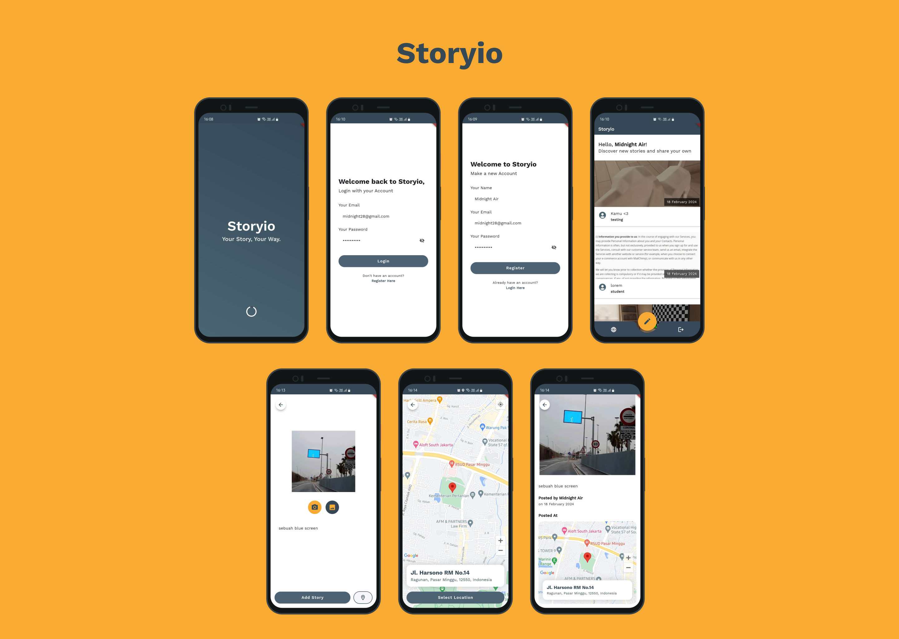

# Storyio
Storyio is a user-friendly Android app built with Flutter. It allows users to easily share their stories by adding photos from the camera or gallery and tagging them with location details. This project was created to fulfill the submission requirements of Dicoding's Flutter Intermediate course.
  
## Prerequisites
Before running the app, make sure to follow these steps:

1. Obtain a Google Maps API Key with the Android Maps SDK.
2. Replace the placeholder `'YOUR_API_KEY'` inside the `AndroidManifest.xml` files with your actual API Key.
  
## Technologies Used
Storyio utilizes the following technologies:

- **Navigator 2.0:** Declarative navigation system.
- **provider:** State management for seamless app flow.
- **http:** Efficiently manages API calls.
- **image_picker:** Handles image selection within the app.
- **location, google_maps_flutter,** and **geocoding:** Enables the app with location tagging functionality.
- **json_serializable:** Facilitates the generation of object classes.
- **Flutter Flavors** Seperated the app into free and paid build variants.
- **Localization support:** Supports both English (EN) and Indonesian (ID) languages.
    
## Preview
